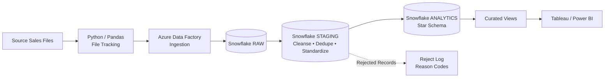

# ❄️ Snowflake ETL & Sales Analytics Data Warehouse

An end-to-end **Snowflake data warehouse and ELT pipeline** that ingests sales data through **RAW → STAGING → ANALYTICS** layers, with incremental loading, data-quality validation, and a star schema designed for BI reporting.

### 🛠️ Tech Stack

**Snowflake · SQL · Python · Pandas · Azure Data Factory · Tableau · Power BI**

---

## 📌 Project Overview

This project simulates a production-style **ELT workflow for sales analytics**.

Approximately **15K sales records** are ingested, cleansed, validated, deduplicated, and transformed into a **star schema**. The pipeline supports incremental processing so that only new or changed records are loaded during each run.

---

## 🏗️ Architecture



---

## 🔑 Key Features

* **Three-layer architecture:** RAW, STAGING, and ANALYTICS.
* **Star schema:** 1 fact table and 4 dimension tables — Customer, Product, Date, and Region.
* **Data cleansing & transformation:** SQL stored procedures for standardization and deduplication.
* **MERGE-based upserts:** Updates existing records and inserts new records without duplicates.
* **Incremental loading:** Watermark-based processing with Python/Pandas file tracking.
* **Data-quality validation:** Source-to-target checks before data reaches the analytics layer.
* **Reject handling:** Invalid records are logged with reason codes for traceability.
* **Pipeline orchestration:** Azure Data Factory manages data ingestion.
* **BI-ready views:** Curated Snowflake views for Tableau and Power BI reporting.

---

## 🔄 Data Flow

### 1. Ingest

Source sales files are tracked using **Python/Pandas** and loaded into the Snowflake **RAW** layer through Azure Data Factory.

### 2. Transform

SQL stored procedures cleanse, standardize, and deduplicate data in the **STAGING** layer. Invalid records are captured in the reject log.

### 3. Load

Validated data is loaded into the **ANALYTICS** layer using `MERGE`-based upserts and watermark-driven incremental processing.

### 4. Validate

Automated **source-to-target validation** checks ensure data completeness and accuracy.

### 5. Serve

Curated Snowflake views provide a clean data source for **Tableau and Power BI dashboards**.

---

## 🗂️ Data Model

The ANALYTICS layer follows a **star schema**:

```text
                    DIM_CUSTOMER
                         |
                         |
DIM_PRODUCT ---- FACT_SALES ---- DIM_DATE
                         |
                         |
                    DIM_REGION
```

### Fact Table

* `FACT_SALES`

### Dimension Tables

* `DIM_CUSTOMER`
* `DIM_PRODUCT`
* `DIM_DATE`
* `DIM_REGION`

---

## 💡 Skills Demonstrated

* Snowflake Data Warehousing
* ELT Pipeline Design
* SQL Stored Procedures
* Data Cleansing & Deduplication
* Incremental Loading
* MERGE / Upsert Processing
* Watermark-Based Processing
* Data Quality & Validation
* Source-to-Target Validation
* Dimensional Modeling
* Star Schema
* Python / Pandas
* Azure Data Factory
* BI Data Preparation

---

## 📁 Project Structure

```text
Snowflake-ETL-Sales-Warehouse/
│
├── README.md
│
├── data/
│   └── sample_sales_data.csv
│
├── python/
│   └── file_tracking.py
│
├── snowflake/
│   ├── 01_database_setup.sql
│   ├── 02_raw_layer.sql
│   ├── 03_staging_layer.sql
│   ├── 04_analytics_layer.sql
│   ├── 05_stored_procedures.sql
│   ├── 06_data_validation.sql
│   └── 07_curated_views.sql
│
├── azure_data_factory/
│   └── pipeline_configuration.md
│
└── screenshots/
    └── architecture.png
```

---

## 📊 Business Use Case

The warehouse enables analysis of:

* Sales performance
* Revenue trends
* Customer performance
* Product performance
* Regional sales
* Daily/monthly sales trends
* Data-quality issues

The curated data can be connected to **Tableau or Power BI** to build interactive sales analytics dashboards.

---

## 👩‍💻 Author

**Aditi Chaudhary**
Data Analyst | SQL | Snowflake | ETL | Python | Azure Data Factory

🔗 **LinkedIn:** https://www.linkedin.com/in/aditi-chaudharydev/
🔗 **GitHub:** https://github.com/Aditi-chaudharyBI
